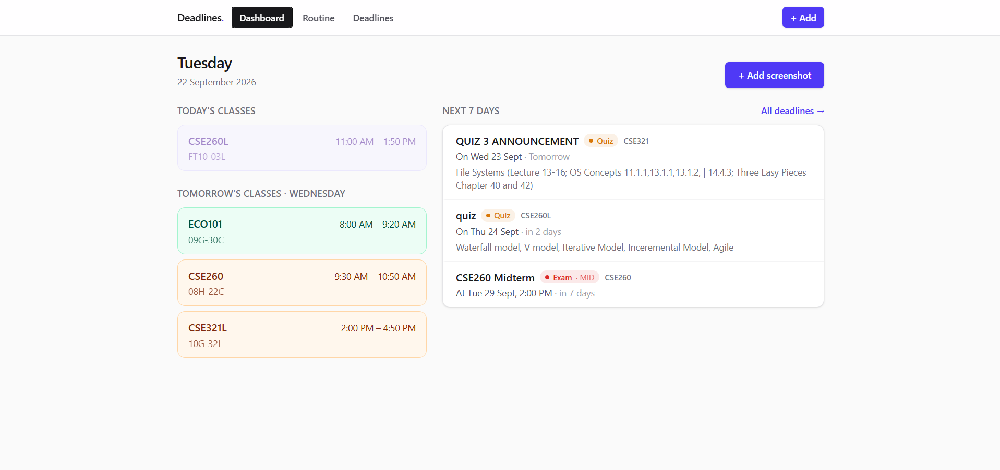

# qvac_tether

A local-first student deadline organizer. Screenshot your class routine or a post about a
quiz, assignment or exam, and on-device AI turns it into your weekly routine or your
deadlines — you review and confirm before anything is saved.



## How it uses QVAC

All AI runs through [`@qvac/sdk`](https://www.npmjs.com/package/@qvac/sdk) **version
0.19.1**, called directly from Next.js route handlers:

- `loadModel` — loads both models once at startup (`lib/qvac.ts`)
- `ocr` — reads the text in the uploaded screenshot (`OCR_LATIN`, EasyOCR pipeline)
- `completion` — decides whether it is a routine or a quiz/assignment/exam and extracts the fields, with output
  constrained to a JSON schema (`QWEN3_4B_INST_Q4_K_M`)

**All inference runs locally on your machine.** There are no cloud AI calls and no API
keys. The only network activity is QVAC downloading the models on first run.

## Requirements

- Node.js **22.17 or newer**, npm 10.9 or newer
- 4 GB+ free RAM, ~3 GB free disk for models
- Windows/Linux: Vulkan 1.4 or newer (`vulkaninfo --summary`), needed even for CPU-only
  inference

## Install

```bash
npm install
```

Models are cached in `~/.qvac/models` by default. To keep them elsewhere, create a
`qvac.config.json` in the project root (it is git-ignored, so it stays local):

```json
{ "cacheDirectory": "D:\\qvac-cache\\models" }
```

## Run

```bash
npm run dev
```

Open http://localhost:3000. The first run downloads the models (~2.6 GB); progress is
logged in the terminal. `GET /api/health` reports when both models are ready.

## Data

Everything is stored in a single `data.json` file in the project root (git-ignored).
No database, no accounts.
